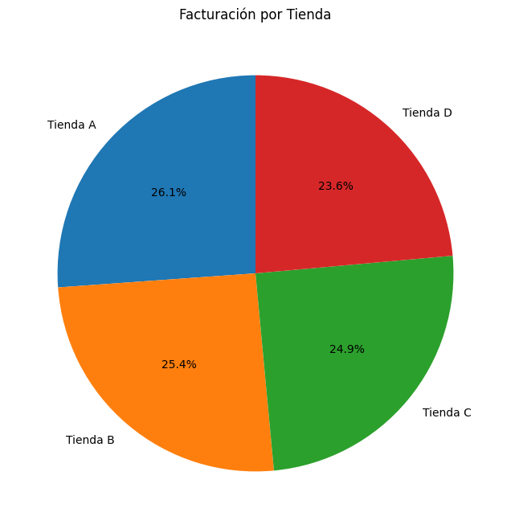
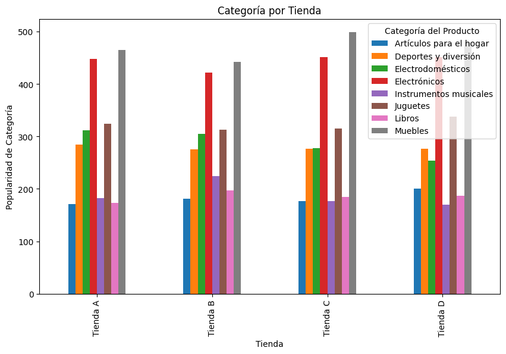
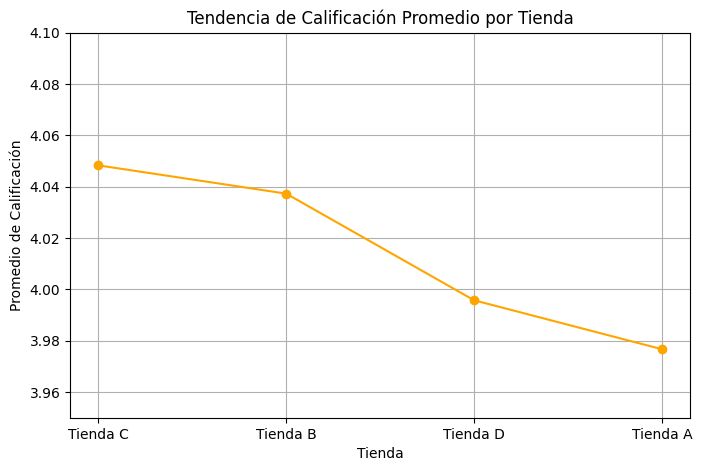

# Informe final — Análisis AluraLatamStore

**Fecha:** November 2025  
**Autor:** Diego Alberto Julcarima Tovar

---

## 1. Introducción

Este informe sintetiza los principales hallazgos del análisis de datos realizado sobre las cuatro tiendas del desafío *Alura Store Latam*. El objetivo es proporcionar una recomendación fundamentada al señor Juan sobre qué tienda debería considerar vender, tomando en cuenta las siguientes dimensiones analizadas:

- Ingresos totales por tienda.  
- Categorías de producto más y menos vendidas.  
- Calificación promedio de los clientes por tienda.  
- Productos más y menos vendidos (por nombre).  
- Coste de envío promedio por tienda.  

El presente documento presenta los resultados cuantitativos, visualizaciones clave y la justificación final de la recomendación.

---

## 2. Metodología (resumen)

- Datos: cuatro archivos CSV (una por tienda). Cada fila representa una venta individual.  
- Herramientas: Python (pandas, matplotlib), Google Colab.  
- Operaciones principales: agrupaciones (`groupby`), tablas pivot (`pivot_table`), cómputo de promedios y conteos, y visualización mediante gráficos exportados al repositorio.  
- Dentro de los datos entregados para analisis no se considero cantidad por venta, solo producto por lo que se procedio a considerar cada venta como "Venta de 1 producto"

---

## 3. Resultados principales

### 3.1 Facturación total por tienda

> **Tabla — Facturación total**

| Tienda   | Facturación |
|----------|------------:|
| Tienda A | 1,150,880,400.0 |
| Tienda B | 1,116,343,500.0 |
| Tienda C | 1,098,019,600.0 |
| Tienda D | 1,038,375,700.0 |

**Gráfico:**  

**Observación:** Tienda D registra la facturación total más baja entre las cuatro.

---

### 3.2 Ventas por categoría (número de unidades vendidas)

> **Tabla — Categoría más vendida por tienda (por número de ventas)**

| Tienda   | Categoría líder | Número de ventas |
|----------|-----------------|------------------|
| Tienda A | Muebles         | 465              |
| Tienda B | Muebles         | 442              |
| Tienda C | Muebles         | 499              |
| Tienda D | Muebles         | 480              |

**Gráfico:**  

**Observación:** Todas las tiendas tienen a *Muebles* como la categoría más demandada.

---

### 3.3 Calificación promedio por tienda

> **Tabla — Calificación promedio**

| Tienda   | Calificación promedio |
|----------|-----------------------|
| Tienda C | 4.048326              |
| Tienda B | 4.037304              |
| Tienda D | 3.995759              |
| Tienda A | 3.976685              |

**Gráfico:**  

**Observación:** Las diferencias entre tiendas son pequeñas (Aproximadamente 0.07 puntos entre extremo superior y extremo inferior), pero Tienda C lidera en satisfacción de clientes, mientras Tienda D es la segunda con calificaciones mas bajas.

---

### 3.4 Productos más vendidos
> **Tabla — Productos con mayor número de ventas**

| Tienda   | Producto                      | Ventas  |
|----------|-------------------------------|---------|
| Tienda B | Iniciando en programación     | 65      |
| Tienda D | Cama box                      | 62      |
| Tienda A | Armario / Microondas          | 60      |
| Tienda C | Kit de bancas / Cama king     | 57 / 56 |

### 3.5 Productos menos vendidos
> **Tabla — Productos con menor número de ventas**

| Tienda   | Producto                                 | Ventas |
|----------|------------------------------------------|--------|
| Tienda A | Auriculares con micrófono / Celular ABXY |   33   |
| Tienda B | Mesa de comedor                          |   34   |
| Tienda C | Set de vasos                             |   36   |
| Tienda D | Armario                                  |   34   |

---

### 3.6 Coste de envío promedio por tienda
| Tienda   | Costo de envío (Promedio)  |
|----------|-----------------|
| Tienda A |   23459.45      |
| Tienda B |   24805.68      |
| Tienda C |   25216.23      |
| Tienda D |   26018.60      |

**Gráfico:**  

**Observación:** El modelo de negocio comprende que el cliente paga el envío.

---

## 4. Análisis y justificación

A partir de los resultados:

- **Facturación:** Tienda D tiene la facturación total más baja (≈1,038 M), lo cual es un indicador financiero directo de bajo rendimiento.  
- **Satisfacción:** Aunque Tienda D no es la peor valorada (ocupa tercero con 3.996), la diferencia con las demás es mínima; por tanto, la ventaja en calificaciones no compensa el volumen de ventas inferior.  
- **Producto y categoría:** Todas las tiendas dependen fuertemente de la categoría *Muebles*; las tiendas con mayores ventas en muebles (Tienda C y A) muestran mejor performance en volumen agregado.  
- **Productos clave:** Tienda D tiene productos estrella (por ejemplo, *Cama box* con 62 ventas), pero en agregado la tienda no alcanza a sus pares.  
- **Coste de envío:** 

**Valoración conjunta:** combinando facturación, unidades vendidas por categoría y calificaciones, **Tienda D** es la candidata más razonable para vender, porque:

1. Registra la **facturación total más baja** entre las cuatro.  
2. No presenta una calificación de cliente lo suficientemente superior para compensar la menor facturación.  

---

## 5. Recomendación

Se recomienda **vender (o suspender operaciones de) Tienda D**, bajo las siguientes condiciones operativas previas a la disposición:

1. **Verificar coste de envío promedio por tienda** y, en particular, confirmar si Tienda D soporta costes logísticos superiores que reduzcan aún más su margen.  
2. **Revisar márgenes brutos por producto** en Tienda D (precio menos coste) para identificar si hay productos altamente rentables que convenga reasignar a otras tiendas antes de la venta.  
3. **Estudiar efectos de estacionalidad y promociones** recientes que pudieran haber deprimido temporalmente las ventas en Tienda D. Si la baja es estacional o por promociones, posponer la venta.  
4. **Plan de mitigación**: si se decide vender, optimizar el inventario (liquidar los productos de baja rotación) y transferir productos de alto rendimiento a tiendas top (Tienda C o A).

---

## 6. Apéndice — Imágenes/Gráficos incluidos

- `img/Invoices.png` — Facturación por tienda.  
- `img/CategoryPerStore.png` — Ventas por categoría (en unidades).  
- `img/RatingPerStore.png` — Calificación promedio por tienda.  
- `img/DeliveryCost.png` — Coste de envío promedio por tienda.

---
